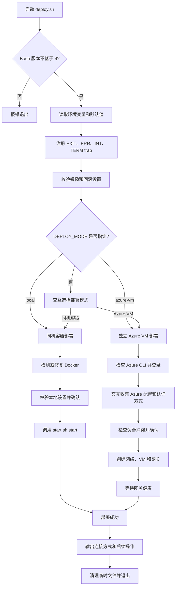
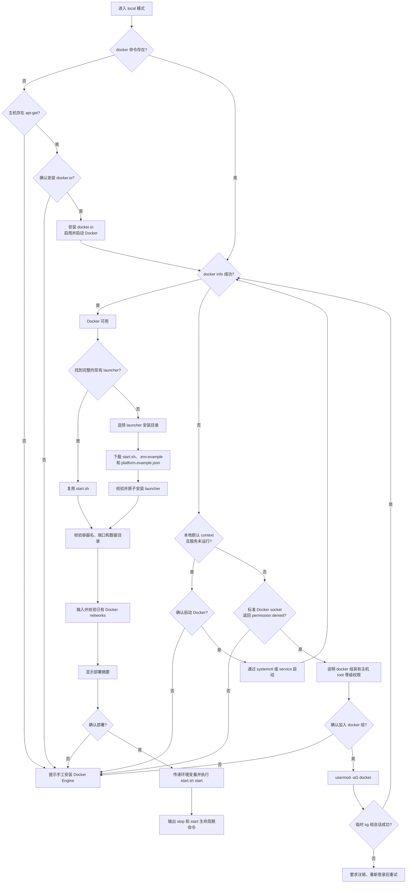
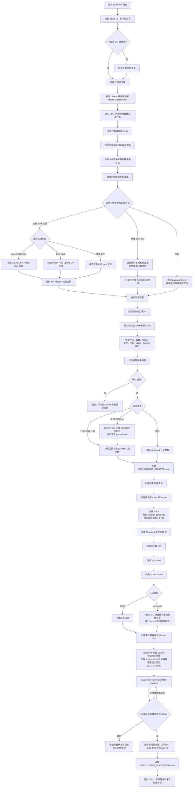
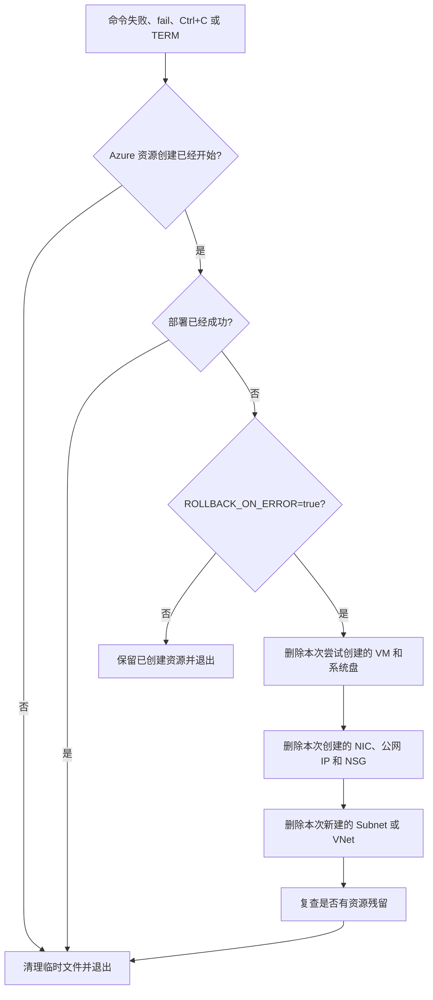

# 部署流程

本文档描述 [`deploy/vm/deploy.sh`](../deploy/vm/deploy.sh) 的实际控制流。脚本提供同机容器和独立 Azure VM 两种模式；同目录的三个 Docker Compose 文件是独立部署入口，不参与本脚本执行。

## 总体流程

## 同机容器部署

同机模式不会创建或修改 Azure 资源、NSG、公网 IP 或 DNS。`DATA_DIR` 必须位于 `~/docker_files` 下，Console 只映射到主机回环地址。

## 独立 Azure VM 部署

密码由 Azure CLI 的隐藏提示读取，不会进入脚本变量或输出。新建密钥模式只把 `.pub` 文件发送给 Azure；私钥保留在本机，最终 SSH 和隧道命令会包含对应的 `-i` 参数。

VM 中的 cloud-init 会安装 `docker.io`、生成 Console 管理令牌、创建网关环境文件，并直接使用 `docker pull` 和 `docker run` 启动网关。该路径不使用 Docker Compose。

## 失败与回滚

回滚只删除脚本标记为本次创建的资源。资源组、已有 VNet、已有 Subnet 和其他原有资源始终保留。新生成的本地 SSH 密钥也会保留，不属于 Azure 回滚范围。

## Docker Compose 的关系

`deploy.sh` 和 `start.sh` 都不调用 Docker Compose。同目录 Compose 文件由 Makefile 的独立目标使用：

| Compose 文件 | 独立入口 |
| --- | --- |
| `docker-compose.yml` | `make compose-up` |
| `docker-compose.socket-proxy.yml` | `make compose-up-proxy` |
| `docker-compose.production.yml` | `make compose-prod-up` |